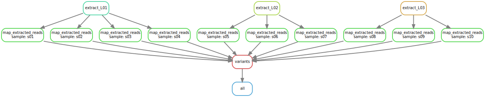

```{r setup, include=FALSE}
knitr::opts_chunk$set(echo = TRUE, comment = NA)
```

This little repo came about as a result of a question that a colleague
at CSU had. She is making a Snakemake workflow for ddRAD data using Stacks
and other components.  

They have 4 or 5 library preps, each one including a large number of individuals
(like 50 to 200).  The reads from each library are in separate fastq files and
they need to be demultiplexed with `process_radtags`.  She has a `samples.csv` file
that tells us which samples are in which library.  But she was finding it
difficult to write a single rule that would run `process_radtags` on each large fastq file.

There isn't a good way to do it with wildcards now that Snakemake does not allow output functions
(if it ever did...).  You could run `process_radtags` once for each individual in each file,
but that would just be ludicrous---making 100 passes through a large file when a single pass
is sufficient to demultiplex all the individuals in it would by inordinately inefficient.

It turns out that this is not the first time that someone has had this problem.  Someone asked about
four years ago and got a response straight from Johannes Köster himself:
[https://stackoverflow.com/questions/41135801/snakemake-best-practice-for-demultiplexing](https://stackoverflow.com/questions/41135801/snakemake-best-practice-for-demultiplexing).

That is worth a read. Basically, as per Johannes, one could either:

1. be ridiculously inefficient,
2. use dynamic files (now deprecated, so instead, think of
checkpoints), or
3. just use a for loop to hard-write one rule for each large fastq file.

I didn't find that post on stackoverflow until I had tried a few things
(which I have left in the file `Snakefail` in this repo).  It was not all a
loss, however, as I learned a lot of interesing things about Snakemake,
one of which seems to be that Snakemake must delete or remove any files created
by a rule that are not explicitly announced as output files of that rule.

At any rate, I show here a simple way of implementing Johannes' #3 approach
by writing a `.smk` file that has one rule for each large fastq that must
be demultiplexed.  Each of these rules has as outputs only the samples fastqs
that the demultiplexing will produce.  

I did this all as a minimal sort of exercise.  I assumed three large input files
that are the equivalent of the large single-library fastqs.  They are:
```{sh, echo=FALSE}
ls data/*
```
They are not large files.  In fact each one just lists the samples that
are inside them:
```{sh}
head data/*
```
But, that is enough to get the logic of this Snakemake problem working.

The sample sheet simply looks like this:
```{sh, echo=FALSE}
cat samples.csv
```
So, it includes tidy, short identifiers for the samples and the libraries.

The code in the Snakefile that gathers up the samples into a dictionary keyed by
the library codes and then writes one rule for each library looks like this:
```python
# read in the samples.csv file
samples = pd.read_csv("samples.csv").set_index("sample")

# from samples, make a data frame of the distinct libraries so
# we can get the infile locations for them
libs = samples[["lib", "infile"]].drop_duplicates().set_index("lib")


################# This is all the stuff I did for dealing with the demulti-plexing problem ########### 

# convenient list of all the big files.
lib_list = list(libs.index)

# this is a function that returns all the extracted files associated
# with a library. It is NOT an input function
def extracted_files_from_lib(L):
	s = list(samples.loc[samples['lib'] == L].index)
	return expand("results/extracted/{S}.fq.gz", S = s)

# then, make a dictionary of those files for each library.
exf_dict = dict()
for L in lib_list:
	exf_dict[L] = extracted_files_from_lib(L)
# make a dictionary of infiles for each library too
inf_dict = dict()
for  L in lib_list:
	inf_dict[L] = libs.loc[L, "infile"]


# now, use python to write a separate rule for each library/big file
# in a new .smk file that we will include. 
rule_template = """

rule extract_{L}:
	input: inf_dict['{L}']
	output: exf_dict['{L}']
	shell:
		"for i in $(cat {{input}}); do echo $i > results/extracted/$i; done;"

"""

with  open('data-determined-demultiplexing-rules.smk','w') as myfile:
	for L in lib_list:
		myfile.write(rule_template.format(L = L))

# here we include that snakefile that has one rule for each
# big fastq that needs demultiplexing
include: "data-determined-demultiplexing-rules.smk"


############# DONE WITH DEALING WITH THE DEMULTIPLEXING PROBLEM #########################

```

That extra Snakemake file that gets written when Snakemake is run is called
`data-determined-demultiplexing-rules.smk` and it looks like this:
```python
`r paste(readLines("data-determined-demultiplexing-rules.smk"), collapse = "\n")`
```

The rules do not do anything exciting, but they do represent a command
line that goes through the input files and uses their contents to create
output files that are not named anywhere on the command line (other than
within the contents of the file).

It all seems to work.  The DAG for the workflow appears here:
```{r, echo=FALSE}

```